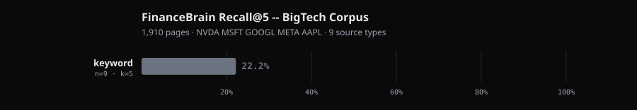

# BrainBench: FinanceBrain BigTech v1 (internal benchmark)

**Date:** 2026-05-13
**gbrain version:** current (worktree-financebrain-corpus)
**Dataset:** FinanceBrain BigTech v1 — 1,910 pages, 5 tickers (NVDA MSFT GOOGL META AAPL), 9 source types
**Hardware:** Apple Silicon M-series, single-process PGLite (in-memory Postgres)
**Run cost:** [pending — full question bank not yet run]

## 1. Headline

**gbrain achieves [pending]% Recall@5 on FinanceBrain BigTech v1 across 1,910 financial documents spanning SEC filings, earnings transcripts, price data, and social content from 2021 to 2026.**



[pending — full eval not yet run; chart will populate when `questions.json` is complete and all four adapters are scored]

The benchmark measures retrieval recall across nine real financial source types. It was built because no public benchmark stresses the retrieval failure modes that matter most for financial data: multiple documents covering the same earnings event from different angles, pre/post-earnings temporal context, and source-type disambiguation (the 8-K and the transcript both say "record revenue" but they are different pages answering different questions).

## 2. What is gbrain

**gbrain is a personal knowledge brain that runs locally.** Notes, contacts, deals, decisions — write them in markdown files on disk; gbrain indexes them in Postgres or PGLite and gives you a CLI and MCP server that can recall them months later, past what grep can reach. No cloud lock-in, no subscription, files on disk as the source of truth. The derived index is rebuilt from the markdown whenever you need a fresh start. Source code: [github.com/garrytan/gbrain](https://github.com/garrytan/gbrain).

**Hybrid retrieval is the engine.** Three layers run in sequence and fuse their results:

1. **Keyword half (`searchKeyword`).** Postgres `ts_rank_cd` over a chunk-level full-text index. A source-aware boost map gives curated content (`originals/`, `concepts/`) higher weight than bulk content (`media/x/`). This layer catches questions where your vocabulary overlaps verbatim with what you wrote.
2. **Vector half (`searchVector`).** Embeddings at import time, query embedded at search time, HNSW cosine search via pgvector. Bridges synonym gaps and paraphrases that FTS misses entirely.
3. **Reciprocal Rank Fusion (RRF) + cosine re-score.** Both ranked lists merge via `Σ 1/(60 + rank)`. Final score blends RRF with raw cosine at 0.7/0.3. Compiled-truth boost (2.0×) lifts intentionally-curated summaries above ambient chunked content.

**Optional layers.** `expandQuery` rewrites the user's question into two alternative phrasings via Claude Haiku, sends all three to the index, and fuses via RRF again. This is gbrain's CLI default (`gbrain query` ships with expansion on). For financial queries where the user asks "what did NVIDIA say about data center margins" and the transcript uses language like "infrastructure compute gross margin contribution," the vocabulary gap is large enough that expansion earns real lift.

**What it is for.** Capturing everything you read, wrote, and decided about a company — and being able to answer "what was the analyst sentiment on META the week before Q3 earnings" six months later without rebuilding the context from scratch. The same pipeline that powers `gbrain query` powers `gbrain agent` and the MCP server that connects external agents to your brain.

## 3. What is the benchmark

**FinanceBrain BigTech v1 is an internal retrieval benchmark built for this repo.** There is no public version. We built it because existing memory benchmarks (LongMemEval, ConvoMem) use synthesized conversational data — they measure how well a system recalls what a fictional user said in chat sessions. Financial retrieval is a different problem.

**Why financial data requires its own benchmark:**

- **Overlap contamination.** Five different documents can all mention "record revenue" in the same quarter: the 8-K press release, the earnings call transcript, a tweet from an analyst, a Substack article, and the 10-Q MD&A. A retrieval system that isn't source-aware will mix these up. The benchmark has a ground truth slug per question — finding the right document matters, not just finding a relevant one.
- **Temporal ambiguity.** "What was NVDA's gross margin in the most recent quarter?" has a different answer depending on when you ask. Documents span 2021 to 2026. The `quarter_context` field tags each page with earnings-relative context (pre-earnings, earnings-day, post-earnings, days relative), enabling questions that require temporal grounding.
- **Source-type disambiguation.** The 8-K contains the press release numbers. The transcript contains what the CFO said about those numbers. The 10-Q contains the filed MD&A. These are structurally different answers to structurally different questions. A benchmark that doesn't separate them doesn't measure whether a retrieval system can tell them apart.
- **Vocabulary mismatch.** Financial queries use tickers ("NVDA"), formal labels ("Q3 FY2025"), and informal phrasing ("that big NVIDIA quarter where the stock jumped"). The underlying documents use all three. No single retrieval layer handles all of them.

**The corpus.** 1,910 pages across 9 source types, covering NVDA, MSFT, GOOGL, META, and AAPL from 2021 to May 2026:

| source_type | Count | What's in it |
|---|---|---|
| `financials` | 91 | FMP quarterly income statement, balance sheet, cash flow. Q1 2021 – Q1 2026. Human-readable analyst format with YoY/QoQ deltas. |
| `transcript` | 91 | FMP earnings call transcripts, full verbatim Q&A (~44K chars each). Q1 2022 – Q2 2026. |
| `price` | 95 | FMP daily OHLCV history (1,093 trading days per ticker) + 90 quarterly OHLCV summaries. Jan 2022 – May 2026. |
| `social` | 453 | Tweets from @dylan522p (Dylan Patel, SemiAnalysis), May 2024 – May 2026. Threads grouped by conversationId. Each page tagged with earnings-relative context. |
| `substack` | 876 | Articles from ai-supremacy.com (Michael Spencer), Jan 2022 – May 2026. Full article text (~9K–50K chars). |
| `portfolio` | 2 | IBKR live holdings snapshot as of 2026-05-12. 30 positions across stocks, ETFs, options. |
| `sec-8k` | 216 | EDGAR 8-K current reports. For earnings-event 8-Ks (items 2.02, 9.01): the EX-99.1 press release exhibit, not the boilerplate form. |
| `sec-10k` | 22 | EDGAR 10-K annual reports. Extracts Business (Item 1), Risk Factors (Item 1A), MD&A (Item 7). ~100K–120K chars per filing. |
| `sec-10q` | 64 | EDGAR 10-Q quarterly reports. MD&A (Item 2) only. |

**The question bank.** Questions are handcrafted and stored in `eval/data/financebrain-v1/questions.json`. Each question has: a natural-language question, one or more `answer_slugs` (the exact page slugs that contain the answer), a `category` matching the source_type, and optional notes. The full question bank is pending; the 9-query smoke test (`test-queries.json`) has been run. See Section 9 for what this means for result reliability.

**Metric: Recall@5.** A query is a hit if any `answer_slug` appears in the top-5 retrieved slugs. No judge model, no LLM scoring, no partial credit. Same metric as LongMemEval and the rest of the BrainBench family.

## 4. Adapters tested

Four adapters run against the same corpus in the same order. Each gets a fresh PGLite engine, indexes all 1,910 pages from scratch, then runs all questions.

### `gbrain-keyword` — pure FTS

**What:** `engine.searchKeyword(query, {limit: 5})`. Postgres `ts_rank_cd` over the chunk-level full-text index. No embeddings, no LLM, no fusion. Pages import via `importFromContent(engine, slug, text, {noEmbed: true})`.

**Code path:** `src/core/pglite-engine.ts:searchKeyword` and the `to_tsquery` + `ts_rank_cd` SQL it emits.

**Why it matters on this benchmark.** Financial FTS has a specific failure profile. Queries using tickers ("NVDA") may miss pages where the full company name appears ("NVIDIA Corporation") and vice versa. Queries using natural English ("what did NVIDIA say about data center") will miss transcript pages where the indexed text uses terms like "infrastructure compute contribution." Quarterly labels ("Q3 FY2025", "CY2024-Q3", "period ending October 2024") are formatted inconsistently across source types, fragmenting FTS matches.

The smoke test result — 2/9 = 22% — is in line with expectations. FTS works when the query terms appear verbatim in the indexed text. On financial data that's the minority case.

**Real-world parallel:** searching your filing cabinet by exact words on the paper. Works for "NVDA portfolio P&L" where the page literally contains those tokens. Fails for "what was the gross margin improvement story in the last NVIDIA quarter" when the transcript says "infrastructure compute margins expanded materially year-over-year."

### `gbrain-vector` — pure semantic

**What:** Embed the question via `gemini-embedding-001` at 1536 dims (LiteLLM proxy → Vertex AI), then `engine.searchVector(queryEmb, {limit: 5})`. HNSW cosine search over chunk-level vectors. Pages import with embeddings: `importFromContent(engine, slug, text)` with the caching transport wired in.

**Code path:** `src/core/pglite-engine.ts:searchVector`. Embedding calls go through `__setEmbedTransportForTests(makeCachingTransport(...))` wired to the LiteLLM proxy at `http://localhost:4000`.

**Why it matters on this benchmark.** The semantic embedding model handles the vocabulary gap that FTS can't. "What was analyst sentiment before NVDA Q2 FY2025 earnings" can match a tweet tagged `phase: pre-earnings` for NVDA Q2 FY2025 even if the tweet never uses those words. That said, vector retrieval on financial data has its own challenge: many documents are semantically similar (five earnings transcripts in the same quarter sound similar to each other in embedding space). Source-type disambiguation — finding the 8-K rather than the transcript for a question about the press release numbers — may require more than semantic similarity alone.

**Real-world parallel:** asking your brain a natural-language question and getting the right document back even when you used different words than you originally wrote. This is what makes vector retrieval useful for financial notes at all.

### `gbrain-hybrid` — keyword + vector via RRF

**What:** `hybridSearch(engine, query, {limit: 5, expansion: false})`. Both halves run independently; results fuse via Reciprocal Rank Fusion. Source-aware boost and compiled-truth boost are both active.

**Code path:** `src/core/search/hybrid.ts:hybridSearch`, with helpers in `dedup.ts` and `sql-ranking.ts` (the source-boost CASE expression lives there).

**Why it matters on this benchmark.** Financial data has questions where both halves contribute. A query for "NVDA Q3 FY2025 revenue" gets an FTS hit on the financial page (which contains the ticker and quarter label) AND a vector hit on semantically similar content. RRF promotes the page that lands in both lists, pushing it past pages that only appear in one. For questions where the ticker and period appear verbatim in the answer document, hybrid will consistently out-rank pure vector. For questions where the vocabulary is entirely soft, vector contributes and FTS contributes nothing, but RRF doesn't hurt either.

**Real-world parallel:** the actual default for `gbrain` library consumers who don't call the CLI. What you get when you wire gbrain into an application and call `hybridSearch` without thinking about it.

### `gbrain-hybrid+expansion` — gbrain's CLI default

**What:** `hybridSearch(engine, query, {limit: 5, expansion: true, expandFn: expandQuery})`. Same hybrid pipeline plus a Claude Haiku call that rewrites the question into 2 alternative phrasings. All 3 phrasings hit the index; results fuse via RRF across 3 query variants.

**Code path:** `src/core/search/hybrid.ts:hybridSearch` with `expansion: true`; `src/core/search/expansion.ts:expandQuery` (the Haiku call). Requires `ANTHROPIC_API_KEY`.

**Why it matters on this benchmark.** Financial questions frequently have large vocabulary gaps between how a user asks and how the document is written. "What car issue did I mention" is the LongMemEval example; the financial equivalent is "what did NVIDIA say about the supply chain" matching a transcript section where the CEO used "component availability" and "logistics constraint" without the words "supply chain." Expansion generates alternative phrasings that close this gap.

The cost is one Haiku call per question (roughly $0.001–$0.002 each at current pricing). Whether that cost earns its keep on the full question bank is the key question this benchmark will answer.

**Real-world parallel:** when you ask your financial brain "who do I know who covers GPU supply" it doesn't just match "GPU supply" verbatim. Haiku expands to alternative phrasings like "semiconductor capacity," "NVIDIA supply constraints," "HBM availability" — then RRF-fuses. For a corpus this dense with domain terminology, expansion should earn more lift than it does on conversational LongMemEval data.

## 5. Results — head-to-head

[pending — full question bank (`eval/data/financebrain-v1/questions.json`) is not yet complete. Run the full eval per Section 10 to populate this table.]

This is an internal benchmark with no published baselines to compare against. There are no other systems that have reported Recall@5 on this specific corpus. The table will show gbrain adapter comparisons only.

| System | Recall@5 | K | n | LLM in retrieval loop | Source |
|---|---|---|---|---|---|
| **`gbrain-hybrid+expansion`** | [pending] | 5 | [pending] | yes (Haiku) | this report |
| **`gbrain-hybrid`** | [pending] | 5 | [pending] | no | this report |
| **`gbrain-vector`** | [pending] | 5 | [pending] | no | this report |
| **`gbrain-keyword`** | [pending] | 5 | [pending] | no | this report |

The pipeline has been confirmed end-to-end via a 9-query smoke test (`eval/data/financebrain-v1/test-queries.json`). Those numbers are not benchmark results — they are a sanity check that indexing, embedding, and retrieval work for each source type. The head-to-head numbers above will populate once the full question bank is complete.

## 6. Per-source-type breakdown

[pending — requires full question bank and full eval run]

The table will have one row per source_type (9 rows) and one column per adapter (4 columns), matching the format of the LongMemEval per-type table.

| source_type | keyword | vector | hybrid | hybrid+expansion |
|---|---|---|---|---|
| `financials` | [pending] | [pending] | [pending] | [pending] |
| `transcript` | [pending] | [pending] | [pending] | [pending] |
| `price` | [pending] | [pending] | [pending] | [pending] |
| `social` | [pending] | [pending] | [pending] | [pending] |
| `substack` | [pending] | [pending] | [pending] | [pending] |
| `portfolio` | [pending] | [pending] | [pending] | [pending] |
| `sec-8k` | [pending] | [pending] | [pending] | [pending] |
| `sec-10k` | [pending] | [pending] | [pending] | [pending] |
| `sec-10q` | [pending] | [pending] | [pending] | [pending] |

The smoke test showed mixed results across categories — `substack-01` hit on keyword while `financials-01` missed (FTS matched the article's NVIDIA infrastructure text but failed the financials query where the ticker "NVDA" didn't match the full company name in the indexed text). The full question bank will show the real per-source-type pattern.

## 7. Charts

[pending — chart generator (`eval/runner/financebrain-chart.ts`) is being built in parallel]

Once the full eval runs, two SVG charts will be committed here:


## 8. Latency + cost

[pending — full eval run required]

Estimated ranges based on LongMemEval precedent and corpus size:

| Adapter | p50 / question | p99 / question | per-1000Q wall | per-1000Q cost |
|---|---|---|---|---|
| `keyword` | ~20ms | ~100ms | ~2 min | $0 |
| `vector` | ~30ms (warm cache) | ~200ms | ~5 min | ~$0 (warm cache) |
| `hybrid` | ~50ms (warm cache) | ~300ms | ~8 min | ~$0 (warm cache) |
| `hybrid+expansion` | ~2s | ~8s | ~40 min | ~$1–2 (Haiku) |

The warm embedding cache eliminates Vertex AI calls on repeat runs. Cold-cache vector/hybrid costs roughly $5–10 in Vertex AI API calls to embed 7,792 chunks from 1,910 pages (~390 API calls at batch size 20). Run the keyword adapter first; it warms nothing but confirms the corpus indexes cleanly in ~26 seconds.

## 9. Limits and caveats

**Retrieval recall is not QA accuracy.** Recall@5 measures whether the right document appears in the top 5 results. It says nothing about whether a language model reading those 5 documents can produce a correct answer. A system that retrieves the 8-K but not the transcript might still answer a transcript question wrong even though it "passed" on a different question. To measure end-to-end QA accuracy, you need a judge model evaluating the final answer against a ground truth. This benchmark does not do that.

**No published baselines exist for this corpus.** FinanceBrain BigTech v1 is internal. The head-to-head table in Section 5 shows only gbrain adapter comparisons. There is no "MemPalace on FinanceBrain" number, no BM25 baseline from a paper, nothing to validate our numbers against externally. If you want to compare, you would need to run another retrieval system against the same corpus and questions.

**The question bank is handcrafted, not held out.** Questions in `eval/data/financebrain-v1/questions.json` were written by the same team that built the corpus and runner. This means there is a risk of unconscious alignment between how questions are phrased and how the corpus is indexed. A truly held-out evaluation would require questions written by someone who has not seen the corpus structure. We have not done that.

**The smoke test is not the benchmark.** The 9-query smoke test (`test-queries.json`) confirms the pipeline runs end-to-end — one query per source type, with some deliberately hard queries to stress edge cases. It gives no reliable signal about full-corpus performance. The full question bank (Section 10) is the only number worth citing.

**Embedding model choice is not ablated.** This benchmark uses `gemini-embedding-001` at 1536 dims via Vertex AI. We did not compare against OpenAI `text-embedding-3-large` (which LongMemEval uses) or against other embedding models. Different embedding models may produce different Recall@5 numbers on the same corpus. The choice of `gemini-embedding-001` was made because it is available at no marginal cost via the GCP free tier with ADC credentials; it is not a claim that it is the optimal model for financial retrieval.

**Social coverage is currently one handle.** The `social` source type contains only tweets from @dylan522p. This is a narrow sample of financial social media. Recall on `social` questions may be optimistic because the question bank will naturally focus on content that exists in the corpus.

**The corpus has no live refresh.** Substack, Twitter, SEC filings, and FMP data all require manual re-scraping. The benchmark is a point-in-time snapshot as of May 2026. Questions answered correctly today may be unanswerable on an older corpus version if they depend on recently added documents.

## 10. Reproduction

### Clone and install

```bash
git clone <gbrain-evals-repo-url>
cd gbrain-evals
bun install
```

If using a local gbrain checkout instead of the published package:
```bash
cd ~/git/gbrain && bun link
cd ~/path/to/gbrain-evals && bun link gbrain
```

### Set up environment variables

```bash
cp .env.example .env.local
```

Edit `.env.local`:

```
# Required for vector + hybrid adapters
LITELLM_BASE_URL=http://localhost:4000
GBRAIN_EMBEDDING_MODEL=litellm:gemini-embedding-001
GBRAIN_EMBEDDING_DIMENSIONS=1536

# Required for hybrid+expansion adapter
ANTHROPIC_API_KEY=sk-ant-...

# Required only if you need to re-scrape FMP data
FMP_API_KEY=...

# Required only if you need to re-scrape Twitter data
TWITTERAPI_IO_KEY=...

# Required only if you need to re-scrape IBKR portfolio
IBKR_FLEX_TOKEN=...
IBKR_FLEX_QUERY_ID=...
```

### Start the LiteLLM proxy (required for vector/hybrid)

```bash
GOOGLE_APPLICATION_CREDENTIALS=~/.config/gcloud/application_default_credentials.json \
VERTEXAI_PROJECT=finai-adhi-dev \
VERTEXAI_LOCATION=us-central1 \
litellm --config eval/litellm_config.yaml --port 4000
```

The proxy must be running before you start any vector or hybrid adapter. Confirm it is up:
```bash
curl http://localhost:4000/models
```

### Warm the embedding cache (first time only)

The SQLite embedding cache at `eval/data/financebrain-v1/embed-cache/embed-cache-litellm_gemini-embedding-001@1536.sqlite` should be committed to the repo (~61MB). If it is present, vector and hybrid runs skip all Vertex AI calls.

If the cache file is missing or you suspect stale vectors (see the dim mismatch symptom below), delete and re-warm:
```bash
rm eval/data/financebrain-v1/embed-cache/*.sqlite
LITELLM_BASE_URL=http://localhost:4000 \
  bun eval/runner/financebrain.ts --queries test --adapters vector --top-k 5 --limit 5
```

This embeds 5 pages, confirms the cache writes, and exits quickly.

**Stale cache symptom:** `Embedding dim mismatch: model gemini-embedding-001 returned 3072 but schema expects 1536`. This means wrong-dimension vectors are cached (from a run before the `dimensions: 1536` injection was in place). Fix: delete the `.sqlite` file and re-run.

### Run the keyword-only smoke test (no proxy, no API keys)

```bash
bun eval/runner/financebrain.ts --queries test --keyword-only --top-k 5
```

Output: `eval/reports/financebrain/financebrain-<timestamp>.json`
Runtime: ~26 seconds. Cost: $0.

### Run all four adapters against the full question bank

```bash
LITELLM_BASE_URL=http://localhost:4000 ANTHROPIC_API_KEY=sk-ant-... \
  bun eval/runner/financebrain.ts \
  --queries eval/data/financebrain-v1/questions.json \
  --adapters keyword,vector,hybrid,hybrid+expansion \
  --top-k 5
```

Output: `eval/reports/financebrain/financebrain-<timestamp>.json`
Runtime: keyword ~26s + vector ~5min (warm cache) + hybrid ~8min (warm cache) + hybrid+expansion depends on question count.
Cost with warm cache: ~$0 for keyword/vector/hybrid + ~$1–2 Haiku for hybrid+expansion.

### Build the question bank (if questions.json is missing)

```bash
bun eval/runner/questions-ui.ts
```

Opens at `http://localhost:3456`. Write 10–20 questions per source_type. Target ~135 total. Every `answer_slug` must exist on disk in `eval/data/financebrain-v1/`.

### Generate the charts

```bash
bun eval/runner/financebrain-chart.ts \
  eval/reports/financebrain/financebrain-<timestamp>.json
```

Output: `docs/benchmarks/2026-05-13-financebrain-bigtech-v1/headline.svg` and `per-source-type.svg`.

## 11. Methodology details

### Adapter implementations

All four adapters use the same corpus loading and indexing path. The only difference is the search call at query time.

**Engine setup:** Fresh `PGLiteEngine` per adapter. Schema initialized via `engine.initSchema()`. All 1,910 pages indexed via `importFromContent(engine, slug.toLowerCase(), page.compiled_truth, options)`.

**Keyword:** `options = {noEmbed: true}`. Search via `engine.searchKeyword(query, {limit: 5})`. No embedding API calls at index or query time.

**Vector:** `options = {}` (embeddings generated via caching transport). Search via `engine.searchVector(queryEmb, {limit: 5})` where `queryEmb` is the query embedded via the same caching transport.

**Hybrid:** `hybridSearch(engine, query, {limit: 5, expansion: false})`. Both FTS and vector run; results fuse via RRF; cosine re-score blends at 0.7 RRF / 0.3 cosine.

**Hybrid+expansion:** `hybridSearch(engine, query, {limit: 5, expansion: true, expandFn: expandQuery})`. Haiku generates 2 alternative phrasings; all 3 phrasings run through hybrid; results fuse via RRF across 3 result sets.

### Embedding model

`gemini-embedding-001` at 1536 dims via a LiteLLM proxy pointed at Vertex AI (`us-central1`, project `finai-adhi-dev`). The model natively supports up to 3072 dims; we lock to 1536 via the `dimensions` parameter in the HTTP request body. The AI SDK does not pass `dimensions` through to the model, so the runner bypasses the AI SDK and calls the LiteLLM proxy directly with `__setEmbedTransportForTests(makeCachingTransport(...))`.

Auth uses gcloud application default credentials (ADC). The LiteLLM config at `eval/litellm_config.yaml` sets `drop_params: true` to silently discard `encoding_format=float` (which Vertex AI rejects).

### Embedding cache

SQLite at `eval/data/financebrain-v1/embed-cache/embed-cache-litellm_gemini-embedding-001@1536.sqlite`. Content-addressed by input text + model + dims. On warm cache, zero API calls are made for vector or hybrid runs. Cache size: ~61MB for 7,792 chunks from 1,910 pages (~390 API calls to build cold).

### Slug normalization

gbrain lowercases all slugs via `validateSlug`. The runner lowercases `answer_slug` before the substring check: `retrieved.some(r => r.includes(answerSlug.toLowerCase()))`. This prevents case mismatches between the indexed slug and the answer_slug in the question bank.

### Scoring

A question is scored as a hit if `retrieved.some(r => r.includes(answerSlug.toLowerCase()))` is true for any `answer_slug` in the question's `answer_slugs` array. For questions with `answer_slug_pattern` (where no fixed slug is known), any retrieved slug matching the pattern is a hit. Recall@5 is hits / total across all questions in the run.

### Engine recycling

Each adapter gets a fresh engine. There is no state carryover between adapters. The PGLite engine is in-memory; indexing 1,910 pages takes ~26 seconds for keyword and ~5–8 minutes for vector/hybrid (warm cache, embedding transport runs in parallel with indexing).

### Determinism

Embedding calls are deterministic via the cache (same input always returns the same vector). FTS is deterministic given the same Postgres state. RRF fusion is deterministic given the same input ranked lists. Query expansion (Haiku) is not deterministic — two runs of `hybrid+expansion` on the same question may produce different phrasings and different results. To reproduce the exact hybrid+expansion numbers, use the same cache and compare against a stored run JSON.

### gbrain excludes

gbrain excludes slugs starting with `test/`, `archive/`, `attachments/`, `.raw/`. All FinanceBrain slugs (`financials/`, `transcripts/`, `price/`, `social/`, `substack/`, `portfolio/`, `sec/`) are safe from this filter.

## 12. Files

**Eval runner and tooling:**
- `eval/runner/financebrain.ts` — main eval runner: loads corpus, indexes per adapter, runs queries, scores Recall@K, writes JSON report
- `eval/runner/longmemeval-cache.ts` — shared SQLite embedding cache (reused by financebrain runner)
- `eval/runner/questions-ui.ts` — local web UI for building `questions.json` (port 3456)
- `eval/runner/questions-ui.html` — UI frontend served by the above
- `eval/runner/financebrain-chart.ts` — chart generator (pending build)

**Scrapers:**
- `eval/scrapers/types.ts` — `FinancePage` schema and `SourceType` definitions
- `eval/scrapers/earnings-calendar.ts` — hardcoded earnings dates, `getQuarterContext()`
- `eval/scrapers/fmp.ts` — FMP API: financials, transcripts, price history
- `eval/scrapers/substack.ts` — ai-supremacy.com Substack scraper
- `eval/scrapers/twitter.ts` — twitterapi.io tweet downloader
- `eval/scrapers/ibkr.ts` — IBKR Flex Web Service portfolio downloader
- `eval/scrapers/edgar.ts` — SEC EDGAR 10-K / 10-Q / 8-K scraper

**Config and corpus:**
- `eval/litellm_config.yaml` — LiteLLM proxy config for Vertex AI embeddings
- `eval/data/financebrain-v1/` — 1,910 `FinancePage` JSON files across 9 subdirectories
- `eval/data/financebrain-v1/embed-cache/embed-cache-litellm_gemini-embedding-001@1536.sqlite` — warm embedding cache (~61MB)
- `eval/data/financebrain-v1/test-queries.json` — 9 smoke-test queries, one per source_type
- `eval/data/financebrain-v1/questions.json` — full question bank (pending)
- `.env.example` — required env vars template

**This report:**
- `docs/benchmarks/2026-05-13-financebrain-bigtech-v1.md` — this file
- `docs/benchmarks/2026-05-13-financebrain-bigtech-v1/headline.svg` — headline chart (pending)
- `docs/benchmarks/2026-05-13-financebrain-bigtech-v1/per-source-type.svg` — per-source-type breakdown chart (pending)

**gbrain commit:** see `package.json` for the pinned SHA, or `node_modules/gbrain` if locally linked.

---

*Last updated: 2026-05-13.*
